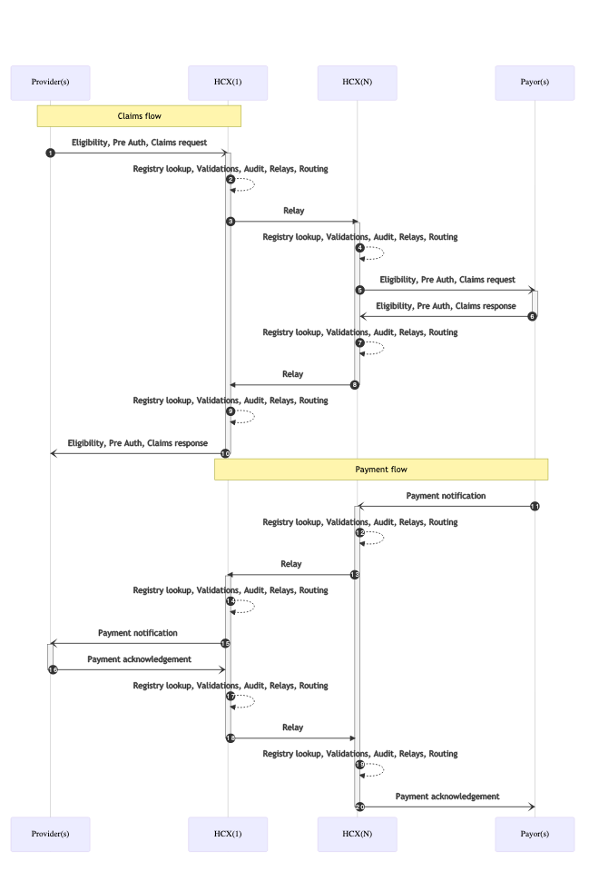

# Appendix A - HCX Relay example

## Scenarios for Cross gateway exchange

The cross gateway communication will be required in the following scenarios –

1. When a provider is onboarded in a gateway instance but the payer for that health policy scheme is registered in another gateway instance.
2. If a beneficiary enrolled in health policy took treatment in a network hospital in another state and that hospital is onboarded in a different gateway instance than the payer.
3. For top-up cases, the providers and payers are registered in different gateway instances and in such scenarios primary insurance is handled by one payer in one gateway instance but the secondary insurance is handled by another payer registered in a different gateway instance.
