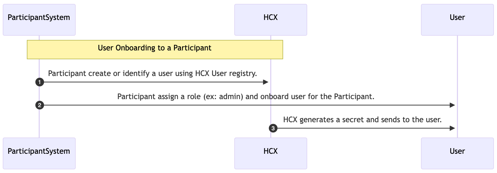

# API Security

The protocol defines an API key-based security for authentication and authorization of the API calls between the participating systems and the HCX gateway. HCX instances have to generate the API keys in the form of JWT tokens ([RFC7519](https://datatracker.ietf.org/doc/html/rfc7519)) and shall mandatorily set an expiry time for all the generated tokens.

In future versions, HCX instances may support JWTs issued by other system identity providers, e.g. Health Facility Registry’s IDP.

## **Securing HCX Gateway APIs**

To secure the HCX APIs, the previous version of the protocol (v0.8) requires participant’s username and password to be used in the token generation API to obtain the API key.&#x20;

However, there could be multiple people responsible for managing participant’s registry and claims exchanges in HCX on behalf of a participant (payer or provider). This could be because of the following key reasons:

* Participants may want to have a quorum of users managing its HCX integration for the purpose of redundancy and business continuity.
* Participants may employ services from one or more Technology Service Providers to handle their claims exchange processes.

In such cases, it is required to use user specific API tokens per participant to ensure security and traceability of actions executed on behalf of a participant.

### **Per Participant, Per User API key**

The protocol recommends using the username and participant specific secret of each eligible user for the participant in generating the API token. To achieve this, participants should onboard users to a participant with a specific role. The below diagram depicts the process of user Onboarding to a Participant:

<figure><figcaption><p>Onboarding User to a Participant</p></figcaption></figure>

1. Participant either creates a new user or selects an existing user from the HCX user registry to initiate onboarding.
2. Participant assigns one or more roles (ex: admin) to the user. This updates the "tenant\_roles" attribute in the User Registry.
3. HCX generates a participant-specific secret for the newly onboarded user and sends it to registered email address of the user.

#### **Steps to obtain the API key:**

After a successful onboarding of user to a participant, use the following details to generate a API key:

* _participant code_**:** The participant systems' code in HCX Gateway participant registry.
* _username_: The primary email address of the user in the HCX Gateway user registry.
* _secret_: The secret or password generated when the user linked with participant along with a role.

The participant system can call ‘_/participant/auth/token/generate_’ API along with the participant code, username and secret to obtain the API key.

> {realm-name} is the security realm name used by the HCX Gateway insteance. Recommended name for the realm is "hcx", but gateway instances are free to use a different name.

```
POST /participant/auth/token/generate
Content-Type: application/x-www-form-urlencoded
Request-Body:
 {
   "participant_code": "", // Participant code in HCX Gateway participant registry.
   "username": "", // Primary email of the user who is attempting to authenticate.
   "secret": "" // Secret of the user for the above participant.
 }
```

HCX Gateway would respond with the API token upon successful validation of the username and secret values for the provided participant code:

```
HTTP/1.1 200 OK
Content-Type: application/json
Cache-Control: no-cache, no-store
Response-Body:
 {
   "access_token": "", // This is the token that the client can use to access protected resources on the server. The token is a JSON Web Token (JWT) that contains claims about the user and the client
   "expires_in": 6000, // The number of seconds until the access token expires. After this time, the client must obtain a new access token.
   "refresh_expires_in": 300, // The number of seconds until the refresh token expires. After this time, the client must obtain a new refresh token. 
   "refresh_token": "", // A token that the client can use to obtain a new access token after the current access token expires. The refresh token is also a JWT that contains claims about the user and the client. 
   "token_type": "Bearer", // The type of token, which is usually "bearer".
   "not-before-policy": 1607576887, // The time before which the token is not valid.
   "session_state": "a1415249-c4eb-49e1-97ea-42c7c91db874", // A unique identifier for the user's session.
   "scope": "profile email" // The scopes that the client has requested access to.
 }
```

The generated API token can be used to execute HCX protocol API requests on behalf of the participant, provided that the user possesses the requisite roles for making such protocol API calls. The below diagram depicts the process of generating and using the API token:

<figure><figcaption><p>Per Participant, Per User API Key generation</p></figcaption></figure>

### **JWT Token Structure:**

API keys are expected to be in JWT format and signed as per JSON web signature ([RFC7515](https://datatracker.ietf.org/doc/html/rfc7515)). The API key should have three elements separated by periods (.): BASE64URL(UTF8(JOSE Header)), BASE64URL(JWS Payload), and BASE64URL(JWS Signature).

* JOSE Header should be a JSON with the following values:

```
{
  "typ":"JWT",
  "alg":"RS256"
}
```

* JWS Payload should be a claim set containing the following claims:
  * participant\_code: participant code of the participant from the HCX Participant Registry
  * user\_id: identifier of the user from the HCX User Registry
  * realm\_access.participant\_roles: roles assigned to this participant
  * realm\_access.user\_roles: roles assigned to the user in this participant
  * iat - unix timestamp at which the JWT is issued
  * exp - the expiration time after which the JWT must not be accepted for processing
* JWS Signature must be computed in the manner defined for RS256 algorithm over the input ASCII(BASE64URL(UTF8(JOSE Header)) || '.' || BASE64URL(JWS Payload)) using the private key of the authentication provider.

## **Securing Participant System APIs**

HCX instances while making the calls to the participant system will use a self-generated JWT token with the following elements:

* JOSE Header should be a JSON with the following values:

```
{
  "typ":"JWT",
  "alg":"RS256"
}
```

* JWS Payload should be a claim set containing the mandatory claims _**jti**_, _**iss**_, _**sub**_, _**iat**_ and _**exp**_.
  * jti - unique identifier for the JWT
  * iss - HCX instance identifier
  * sub - same as iss claim, HCX instance identifier
  * iat - unix timestamp at which the JWT is issued
  * exp - the expiration time after which the JWT must not be accepted for processing
* JWS Signature must be computed in the manner defined for RS256 algorithm over the input ASCII(BASE64URL(UTF8(JOSE Header)) || '.' || BASE64URL(JWS Payload)) using the private key of the HCX instance.

Participant systems should validate the API key signature using the public key of the HCX instance.
