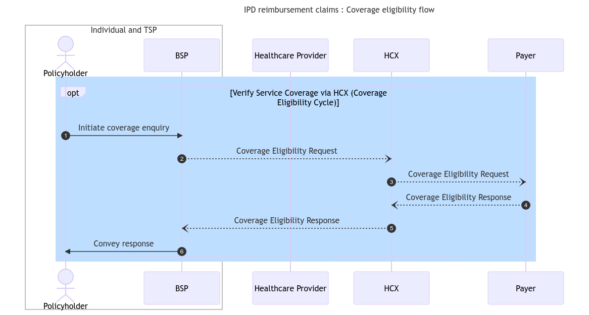

# Reimbursement

The reimagined IPD reimbursement claims workflow leveraging HCX protocol help us understand how claim requests can processed timely and efficiently. HCX will bring interoperability and transparency in the claim adjudication process.

[Link to the typical IPD](broken-reference) reimbursement claims workflow.


**Important note :** The work stream's original diagram representing the overall workflow of the reimagined IPD reimbursement flow using HCX is available [here](https://drive.google.com/file/d/1lxsoR0SfrriGoQ38aiQH3TBmDHGc1OSq/view?usp=sharing). Based on initial feedback for improving the readability, the sections below detail it in multiple diagrams representing each stage separately.


### **IPD reimbursement claims**&#x20;

**Coverage eligibility flow**

Even in a reimbursement situation, an IPD service delivery and claims process could start with the beneficiary/policyholder checking their coverage eligibility using the BSP interface. This would serve as a pre-notification for the payer, and aid the beneficiary in obtaining the initial details regarding the coverage. The following diagram shows the steps and stakeholders involved in the coverage eligibility flow.

<figure><figcaption></figcaption></figure>

#### **Claims flow**

Once the services are provisioned and the beneficiary is discharged, the Beneficiary/policyholder would initiate a reimbursement claim request with the payer through HCX, furnishing the necessary information for the claim adjudication. The beneficiary would use a BSP app to start the claim. Before processing a claim, the Payer would seek consent from the beneficiary to ensure claim authenticity. The following diagram describes the steps and stakeholders involved in the claims flow through HCX.&#x20;

<figure><figcaption></figcaption></figure>

The next section describes IPD usecase key implementation considerations.
