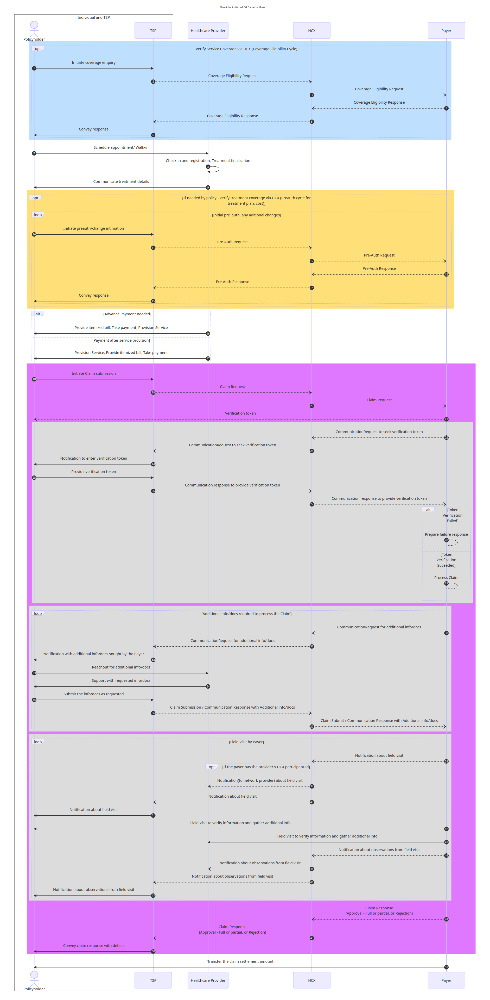

# IPD

The reimagined IPD reimbursement claims workflow leveraging HCX protocol help us understand how claim requests can processed timely and efficiently. HCX will bring interoperability and transparency in the claim adjudication process.

Link to the typical IPD reimbursement claims workflow.

Reimagined IPD reimbursement claims workflow using HCX :&#x20;

<figure><figcaption></figcaption></figure>

Following section, provides insights OPD claims workflow leveraging HCX protocol.
