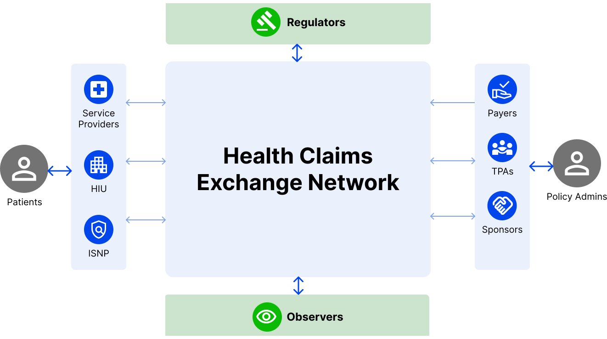

# Introduction to HCX

The Health Claims data Exchange can be envisioned as analogous to the internet in general and email exchange networks more specifically, where data packets travel to and fro between an origin and the destination. In this context, Health Claims Data Exchanges can be thought of as routing switches or email gateways that facilitate communication with the desired level of consistency, security, privacy, and durability. However, unlike the internet or email, this protocol is defined for a specialized use case of exchanging claims-related information between relevant actors - payors, providers, beneficiaries, regulators, observers.

The figure below shows a simple depiction of a health claims network facilitated by an HCX instance:

<figure><figcaption></figcaption></figure>

### Vision, Mission, and Objectives

1. Expand Insurance Penetration
   1. Significantly lower cost of claims processing implies new use cases – such as OPD and Pharmacy
   2. New kinds of payors in the market that can lead to an increase in insured base
   3. Reduce receivable cycles and increase acceptance of cashless claims (even in smaller hospitals)
2. Facilitate insurance innovation
   1. Highly personalized policies
   2. Short duration, low premium policies
   3. Auto adjudication, better fraud and abuse prevention
3. Simplify and bring efficiency to claims processing
   1. Standardized claims process, less operational overheads
   2. Increase trust among payers and providers through a transparent, rule-based mechanism
4. Better patient experience

### Key Use cases/Workflows

The current version of specifications are designed to cater to both cashless & reimbursement health claims processes and envisions to facilitate the following information flows:

1. Get provider/payor details
2. Eligibility check
3. Preauthorization request flow
4. Claims request flow (including Enhancements, Discharge and Settlement)
5. Status check&#x20;
6. Fetch data for regulatory compliance, etc.
7. Requesting & sharing additional information about claims
8. Communication flows (for additional information about claims and sharing proof of patients consent to process claims on their behalf)
9. Notifications (including network, participant & workflow related notifications)
10. Payment notification
11. Payment acknowledgement

### Key Constituents

The claims network will consist of the following key building blocks:

1. **Specifications** - this layer defines the blueprint for different aspects of the claims network. These include communication protocols, data packet specifications, Taxonomies, privacy and security specifications, network policies (onboarding and deboarding rules), business rules, operational specifications, etc. Please note that the document intentionally calls these artifacts as specifications to indicate that they become standards only after a “de jure” or “de facto” adoption by the ecosystem.
2. **Reference Health Claims Exchange (aka switch) software** - A reference gateway implementation build as per the standards defined above. The main goal here will be to provide fundamental software building blocks of the network to enable faster adoption by the ecosystem.
3. **Compliance sandbox** - Implemented using the above reference software, the key goal of the sandbox will be to help the ecosystem test its specific components against the network standards defined above and get certified to become part of the network.
4. **Health Claim Exchange runtime(s)** - Operating instances of the health claims platform that enable real-world claims interactions on the network. Like with the internet and email example, there can be multiple such running instances that are expected to be interoperable by adhering to the standards defined as in #1 above.
5. **Participating systems** - These are digital systems of the network participants (Payors, Providers, Regulators, Observers, etc) that sit on the edges of the claims network and initiate/receive the communication happening through the network. These would be analogous to client/servers in the internet analogy and various email service providers in the email analogy.

The following sections describe the key aspects of the proposed open specifications including design principles, a list of key specifications, proposed governance and details of technology and domain specifications work completed so far.

HCX specifications could enable the existence of multiple HCX instances and relays between them (please see example flow [here](hcx-technical-specifications/open-protocol/key-components-building-blocks/exchange-protocol.md#relay)).&#x20;

### Key Specifications

This section lists key types of specification needed for Health Claims data exchange.&#x20;

#### Technical Specifications&#x20;

Like HTTP or SMTP, open protocol (Health Claims data Transfer Protocol) for claims exchange will define the following key aspects:

1. Authentication (Payor, Provider, Regulator, Observer, ...)
2. Request/response message syntax - header and header attributes, optional body, mandatory vs optional, transport constraint on the messages, etc.
3. Supported methods (APIs)
4. Communication mode (synchronous or asynchronous nature of APIs)
5. Response codes
6. Data security and privacy considerations: Security, authenticity, and non-repudiability aspects of message exchange
   1. Encryption of certain parts of message for transport security (beyond SSL on Health Claims data exchange)
   2. Message signing protocol for verifiability and non-repudiation
7. Sequence of interactions

In addtion, Technical specifications may include the following types of technical operations policies: &#x20;

1. Key rotation requirements
2. Segregation of duties and responsibilities within various teams of exchange operators
3. Operational reports and dashboards
4. Audit checklist and frequency

#### Domain Specifications

Specifications about format and definition of domain specific elements. A lot of these may be adopted from existing domain standards like FHIR, SNOMED, ICD-10-PCS. In the context of claims data exchange few key focus areas will be:

1. **Domain data model** - Schema definition of domain entities like Coverage Eligibility, Claims, Providers, Payers, Policies, etc. [FHIR specifications](https://hl7.org/fhir/overview.html) from HL7 have been adopted by the HCX community to define domain entities.
2. **Metadata specifications** - Metadata is data that describes data, data associated with an object, a document, or a dataset for the purposes of description, administration, technical functionality, and preservation. In the context of claims, this would mainly involve coding systems and value sets for key claim attributes, such as disease codes, procedure codes, diagnostic codes, billing codes (product or service e.g. room rent, ICU charges), etc.
3. **Domain-Specific Language(s)** - These may be developed when the attributes of the entity are different from use case to use case, but they need to follow some common rules/characteristics, like the types of data elements it can have. It essentially helps define the needed Data Models in a particular domain. The HCX community has investigated and found that combination and extension of the FHIR resources suffices for the currently envisioned use cases, and therefore has not felt a need to define any DSL as of now. The DSL option is included here as a possible option if a need ever arises for future use cases.&#x20;

#### Business Policy Specifications

A thriving data exchange will also require clear rules of engagement to ensure trust from all actors. These specifications will involve guidelines around:

1. Onboarding policies - How does any entity get on board on the data exchange? Adherence to protocol, the process for a compliance review, frequency of compliance review, etc
2. Deboarding policies: What makes an entity to be blocked or ejected from the data exchange. Things like adherence to technical SLAs, non-compliance with expected protocol versions, message security or privacy violations, etc.
3. Access control policies (Data sharing policies) -  which actor plays what role and gets to see which parts of the data. These policies will then affect the visibility and access to domain-specific attributes that will typically travel in the body of the data structures defined by the data exchange. Role-based, need for consent to access APIs, data attributes, etc.
4. Business SLAs
5. Charges/Fees - these would be policies around charges various data exchange entities will be allowed to levy on others depending on the role they play
6. Dispute resolution policies
7. Onboarding
8. Defaulting/deboarding policies
9. Service rating policies - that would be the parameters and mechanisms to rate each type of actor on the data exchange.
